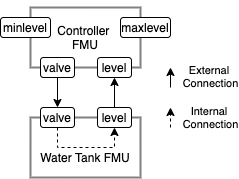
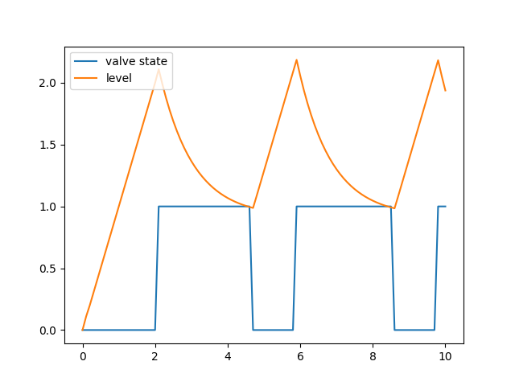

.. _getting_started:

Getting Started
==================
This section takes you through a the entire process of conducting a co-simulation with Maestro2.

| This guide is based on the command line interface (CLI) of Maestro2 and consists of two parts: 
| The first part :ref:`getting_started_part1` concerns writing a MaBL Specification by hand and executing it.
| The second part :ref:`getting_started_part2` concerns using the specification generation feature of Maestro for generating the specification.

Note that Maestro2 also features a web API presented in :ref:`web-api`.

Setup
-----
The first step is to install the dependencies along with the tools and resources that are to be used

- Download and install Java 11
- Download the :download:`getting started part1 resources <images/wt_example/getting-started-part1.zip>` and unzip into a directory.
- Download the :download:`getting started part2 resources <images/wt_example/getting-started-part2.zip>` and unzip into a directory.
- Download `maestro-2.x.x-jar-with-dependencies.jar` from the newest `Maestro2 2.x.x` release on the Maestro release page https://github.com/INTO-CPS-Association/maestro/releases and place it in the same directory as the example resources were unzipped into.

Example
-------
The example throughout this getting started guide concerns a water tank. The tank (Continuous Time component) has a constant inflow of water and a valve that is controlled by a controller (Discrete-Event component). When the valve is open, the water level within the tank decreases, and whe the valve is closed, the water level increases.
The controller determines when to open and close the valve based on a maximum and a minimum water level.

.. _fig-watertankexample:

    Water Tank Example

.. _getting_started_part1:

Part 1: First MaBL Specification
------------------------

The corresponding MaBL code, including descriptive comments, to execute this co-simulation is presented below:

.. literalinclude:: images/wt_example/wt-example.mabl
    :language: c

To execute this (one can use the file corresponding wt-example.mabl from the unzipped example resouces) run the following command from the terminal:

.. code-block:: none

    > java -jar maestro-2.x.x-jar-with-dependencies.jar --interpret wt-example.mabl
        where --interpret is to interpret a specification

The result is available in `outputs.csv`. This can be plotted with `part1pythoncsvplotter.py`, and the result should look like the figure below.

.. _fig-watertankexample-result:

    Result from co-simulation

.. _getting_started_part2:

Part 2: Specification Generation and Expansion
----------------------------------------------
This part also concerns the water tank but uses the capabilities of specification generation and expansion to create the specification. Thus, the user does not have to write MaBL by hand. Specification generation and Expansion are not treated in detail in this guide, but more information is available in :ref:`Specification Generation` and :ref:`Expansion`.

The specification generator is based on JSON configuration files with the same structure as the ones used in Maestro1. For this reason, it is also possible to use the `INTO-CPS Application <https://into-cps-association.readthedocs.io/projects/desktop-application/en/latest/>` to create the specification files.

Configuration file
^^^^^^^^^^^^^^^^^^
The content of the configuration file is briefly described after the example below. A more detailed description is available at :ref:`sec:legacy_config_format`. The configuration for this example is:

.. literalinclude:: images/wt_example/wt-example-config.json
   :language: json

- :code:`fmus` contains mappings between a key, enclosed in :code:`{}` and the corresponding FMU.
- :code:`connections` contains mappings from a single FMU output port to one or more FMU input ports. The format of a port is :code:`{fmuKey}.instance.scalarVariableName`
- :code:`parameters` contains mappings from a single FMU parameter port and a value.
- :code:`algorithm` describes that the fixed-step algorithm should be used with the size 0.001. Currently only fixed-step is supported.
- :code:`end_time` is the end-time of the simulation

Specification Generation
^^^^^^^^^^^^^^^^^^^^^^^^
The command below generates the specification based on the configuration file above:

.. code-block:: none

    > java -jar maestro-2.x.x-jar-with-dependencies.jar --spec-generate1 wt-example-config.json --dump "./"
        where
            --spec-generate1 uses a specification generator build for legacy configuration files (i.e. configuration files for maestro1)
            --dump describes to dump the final specification at the current directory

Final specification and Execution
^^^^^^^^^^^^^^^^^^^^^^^^^^^^^^^^^
The final specification is in the file `spec.mabl` and is not presented in detail, but you can see it here: :download:`spec.mabl <images/wt_example/spec.mabl>`.

Furthermore, a `spec.runtime.json` file has been produced with information for the runtime DataWriter CSV plugin with information on where to store the csv result:

.. literalinclude:: images/wt_example/spec.runtime.json
    :language: json

Execution
^^^^^^^^^
To execute the specification execute the following command:

.. code-block:: none

    > java -jar maestro-2.x.x-jar-with-dependencies.jar --interpret spec.mabl
        where
            --interpret informs maestro to interpret the subsequent specifications

The interpreter will automatically look for :code:`*.runtime.json` files within the same directory as the jar file.

Similar to above in :ref:`getting_started_part1`, the results can be viewed and plotted with the accompanying python script: `part2pythoncsvplotter.py`

Extra: Expansion
^^^^^^^^^^^^^^^^
This section gives a small insight into the expansion feature of Maestro. It is possible to use expansion plugins within in a MaBL specification. When Maestro encounters a MaBL expand statement during processing, it will replace the statement with MaBL code generated by the related expansion plugin. This happens automatically in the part2 example, but it can be made obvious.

Run the command below:

.. code-block:: none

    > java -jar maestro-2.x.x-jar-with-dependencies.jar --spec-generate1 wt-example-config.json --dump-intermediate "./part2mabl-intermediate"
        where
            --dump-intermediate describes to dump the specification after every expansion iteration at "./part2mabl-intermediate"

The directory `part2mabl-intermediate` now contains files with different numbers in increasing order due to the flag :code:`--dump-intermediate "./part2mabl-intermediate"`. 
The initial specification, `spec00000.mabl`, refers to the specification generated by the specification generator without any expansions carried out. `spec00001.mabl` is the specification after 1 expansion has been carried out and so forth. The larget number referes to the specification after all expansions has been carried out.

`spec00000.mabl` is the specification generated by the specification generator which contains several annotations (marked with :code:`@`) and two expand statements (begins with: :code:`expand`): :code:`initialize` and :code:`fixedStep`. The reason for these annotations are that the file is self-contained. The relevant information to generate the final specification is added to the specifications via these annotations. See the example below and the description afterwards:

.. literalinclude:: images/wt_example/spec00000.mabl
    :language: none
    :linenos:

- Line 5-6 describes the framework and the JSON necessary to generate the configuration of the framework context, which is needed by the expansion plugins.
- Line 47 describes a configuration used specifically for the :code:`initialize` expansion plugin on the subsequent line
- Line 48 specifies that the initialize expansion plugin should be expanded.
- Line 49 specifies that the fixedStep expansion plugin should be expanded.

The next example presents an extract of the new specification generated after the expansion of line 47 and 48 containing :code:`@Config(...)` and :code:`expand initialize(...)`. The full specification at this stage of expansion is available at :download:`here<images/wt_example/spec00003.mabl>`. Thus the :code:`@Config(...)` and :code:`expand initialize(...)` has been replaced with the MaBL generated by the corresponding initialize plugin. As it can be seen on line 127, :code:`fixedStep` has not been expanded yet.

.. literalinclude:: images/wt_example/spec00003.mabl
    :lines: 46-127
    :lineno-start: 46
    :linenos: